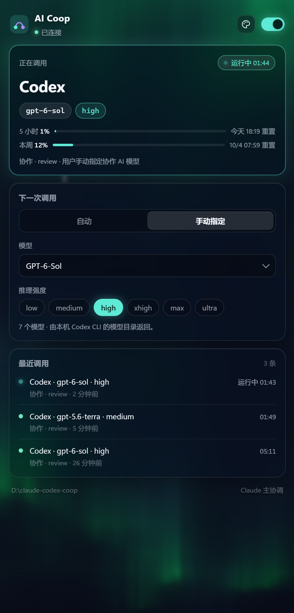
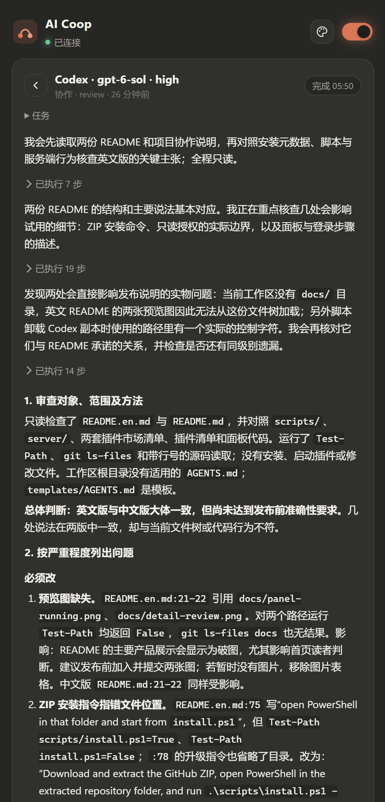

# Claude-Codex-coop

English · [中文](README.md)

**Sound familiar?**

- An AI gives you a confident, well-argued answer, and you can't tell whether it's right or just hallucinating;
- To have Claude and Codex check each other, you copy and paste between two windows, and when they disagree you don't know whom to trust.

**Claude-Codex-coop lets the two AIs check each other's work inside a single conversation.**

Keep chatting in the Claude desktop app or the Codex desktop app as usual. The AI you're talking to becomes the **coordinator**: it forms its own view first, calls the other AI when it helps to review the answer, look for counterexamples, or implement a change, checks the other side's evidence point by point, and then gives you one combined answer that says what's verified and what's still uncertain.

| Where you chat | Coordinator | Second AI, called as needed |
|---|---|---|
| Claude desktop | Claude | Codex |
| Codex desktop | Codex | Claude |

<table>
  <tr>
    <td width="50%"></td>
    <td width="50%"></td>
  </tr>
  <tr>
    <td>Side panel: the partner's model, reasoning effort, live usage and call history</td>
    <td>Open any call to read the partner's full reply</td>
  </tr>
</table>

> Windows 10/11 preview (macOS planned). Requires the Claude and Codex desktop apps and Python 3.10+. The panel UI is currently in Chinese. [Install](#install)

## How it differs from OpenAI's codex-plugin-cc

[OpenAI's codex-plugin-cc](https://github.com/openai/codex-plugin-cc) lets you call Codex from Claude Code, with commands, natural-language delegation and an optional review gate. This project focuses on something different:

- **Both directions**: installed into both the Claude and Codex desktop apps; whichever side you chat in can call the other.
- **Automatic review with a clear process**: once enabled, it calls the partner when the task warrants it. The coordinator states its own view first, hands over a structured brief, verifies the evidence item by item, turns disagreements into concrete checks, and marks what's verified versus uncertain. Useful for code, writing and analysis, whenever a plausible answer may still be wrong.
- **A visual side panel**: see the partner's model, account usage, full replies and live progress at any time.

## Features

- **Automatic collaboration**: turn it on once; tasks that benefit from a second AI trigger it automatically, while greetings and status checks don't.
- **Collaboration protocol**: the coordinator sends a goal, known facts, its own view, specific questions and acceptance criteria; the partner answers in one of four modes (analyze, decide, review, implement); at most two rounds per task.
- **Side panel**: the partner's model, reasoning effort, live status, account usage and tokens used by the current call; full replies (reasoning and command steps collapsed by default); pick the model and reasoning effort for the next call; follow the app's light/dark theme or choose an animated background (aurora, galaxy, horizon).
- **Per-task permission**: analyze, decide and review are read-only; implement edits files only with your approval. Same rules on both sides.

## Install

**Requirements**: Windows 10/11; Python 3.10+ runnable as `python --version` in PowerShell; the Claude and Codex desktop apps, both signed in.

### Option 1: plugin marketplaces (recommended)

In the Claude desktop app's Code chat (or Claude Code):

```text
/plugin marketplace add youagainchen/claude-codex-coop
/plugin install ai-coop@claude-codex-coop
```

For Codex, in PowerShell:

```powershell
codex plugin marketplace add youagainchen/claude-codex-coop
codex plugin add ai-coop@claude-codex-coop
```

### Option 2: install script

```powershell
git clone https://github.com/youagainchen/claude-codex-coop.git
cd claude-codex-coop
.\scripts\install.ps1 -Target Both
```

No Git? Download and extract the ZIP from GitHub, open PowerShell in the extracted repository folder, and run `.\scripts\install.ps1 -Target Both`. If PowerShell refuses to run scripts, use `powershell -ExecutionPolicy Bypass -File .\scripts\install.ps1 -Target Both`.

- One side only: `-Target Claude` or `-Target Codex`. Prevent the partner from editing workspace files: add `-ReadOnly`.
- Upgrade: `git pull`, then run `.\scripts\install.ps1 -Target Both` again.

Afterwards, **fully quit and reopen** both apps.

## Usage

1. In either app, say **"Open AI Coop"** (or "打开 AI Coop"). The panel appears on the right and automatic collaboration turns on.
2. On first use, if the panel says the Claude CLI isn't signed in, click **"登录 Claude CLI"** and authorize in the browser with the same account you use in the Claude desktop app (one time only).
3. Describe tasks as usual. Try: *"Review this project's README, ask the other AI to find what's missing, and reconcile any disagreements."* A new entry in the panel's call history means it's working.
4. To choose the partner's model or reasoning effort, pick "手动指定" (manual) under "下一次调用" (next call) in the panel, or just say so in the chat, e.g. "have Codex review this using gpt-6-sol with high reasoning effort".
5. To turn it off, use the switch at the top right of the panel, or say "关闭 AI Coop".

## Data and privacy

- **What the partner AI receives**: the task brief plus a read-only snapshot of the current workspace: a file list (up to 400 entries) and common project notes (`AGENTS.md`, `CLAUDE.md`, `README.md`, etc.).
  - The snapshot skips files that look like secrets or credentials (`.env*`, `*.pem`, `*.key`, `id_rsa*`, `*credentials*`, `*secret*`, …) and folders such as `.git`, `.ssh` and `node_modules`.
  - Put a `.ai-coop-context` file in the project root (one relative path per line) to choose which project notes accompany the file list; secret-looking files are skipped even if listed.
- **Local records**: each call's request, reply and event stream are kept in `~/.ai-coop/runs/`.
- **Account usage and model lists** (usage is a preview feature, panel display only): usage is queried with the CLIs' existing credentials (`api.anthropic.com`, `chatgpt.com`); Claude models come from Anthropic's model API, Codex models from the local Codex CLI. The usage endpoints aren't publicly documented and may break when either app updates; if they do, the panel simply stops showing usage and collaboration keeps working.

## Uninstall

- Marketplace install: `/plugin uninstall ai-coop@claude-codex-coop` in Claude; `codex plugin remove ai-coop@claude-codex-coop` in PowerShell.
- Script install: `.\scripts\uninstall.ps1 -Target Both`; add `-Purge` to also delete run records in `~/.ai-coop`.

## Troubleshooting

- **Calls keep failing**: run `.\scripts\doctor.ps1` and check that both `codex_exe` and `claude_exe` have paths. A `null` means that CLI wasn't found; point to it with `AI_COOP_CODEX_EXE` / `AI_COOP_CLAUDE_EXE`.
- **Python not found**: install Python 3.10+ with "Add to PATH" checked (marketplace installs need `python` on PATH); for script installs you can also set `AI_COOP_PYTHON_EXE`.

## How it works

The plugin is a local MCP server (`server/mcp_server.py`, Python standard library only). When the coordinator calls `start_workflow`, the server runs the other side's CLI in the background (`codex exec --json` or `claude -p --output-format stream-json`), streams its events to the panel, and hands the result back to the coordinator. Calls to Claude always use the account signed in to the Claude CLI. The panel (`server/sidebar.py`) listens on `127.0.0.1` only, on a random port with a per-session token.

Run the tests with `python -m unittest discover -s tests`.

## License

Code is MIT-licensed; see [LICENSE](LICENSE). The panel's "aurora" background is adapted from a Shadertoy work by nimitz; see [NOTICE.md](NOTICE.md) for attribution and license.
